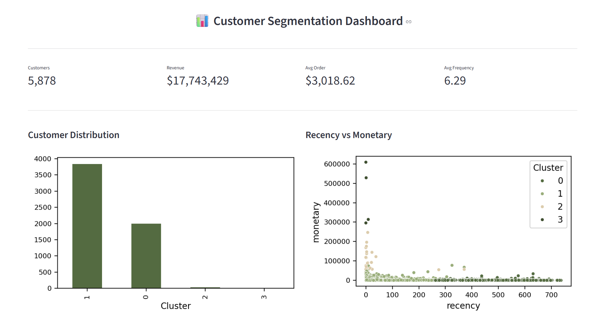
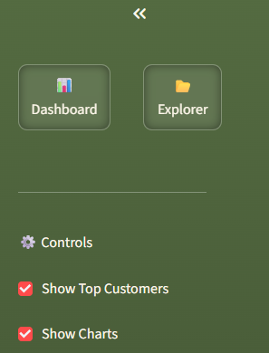
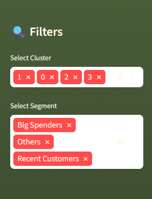
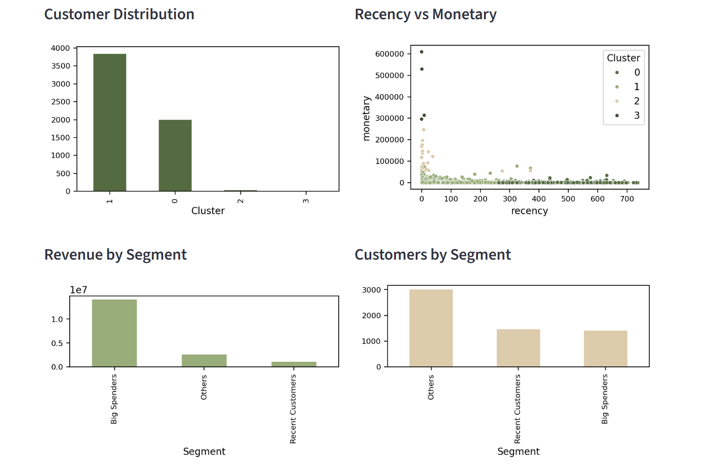
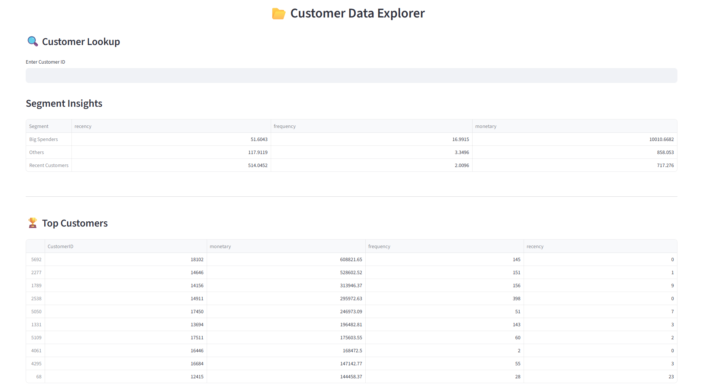

# 📊 Customer Segmentation & Revenue Optimization System

This project builds an end-to-end customer analytics system to identify high-value customers and optimize business revenue using data-driven techniques.
It combines RFM analysis, machine learning, and interactive dashboards to simulate real-world business decision making.

---

## 🧠 Key Features
- RFM Analysis (Recency, Frequency, Monetary)
- K-Means Clustering for customer segmentation
- Interactive Streamlit dashboard
- Business insights & recommendations

---

## 🛠️ Tech Stack
- Python (Pandas, NumPy, Seaborn)
- SQL (SQLite)
- Scikit-learn
- Streamlit

---

## 📊 Dashboard Preview

### 🔹 Main Dashboard
<p align="center">
  
</p>

---

### 🔹 Filters & Navigation
<p align="center">
  
  
</p>

---

### 🔹 Charts & Insights
<p align="center">
  
</p>

---

### 🔹 Data Explorer
<p align="center">
  
</p>

---

## 📂 Dataset
Dataset is not included due to size limitations.

Download here:
👉https://drive.google.com/drive/folders/1sf-hfbRqsJCkavKGa6F6JTLKgDrrZ9Zg?usp=drive_link

## ⚙️ How to Run

1. Download dataset  
2. Place inside `data/` folder  
3. Run:
```bash
python -m streamlit run app/bi_like.py
