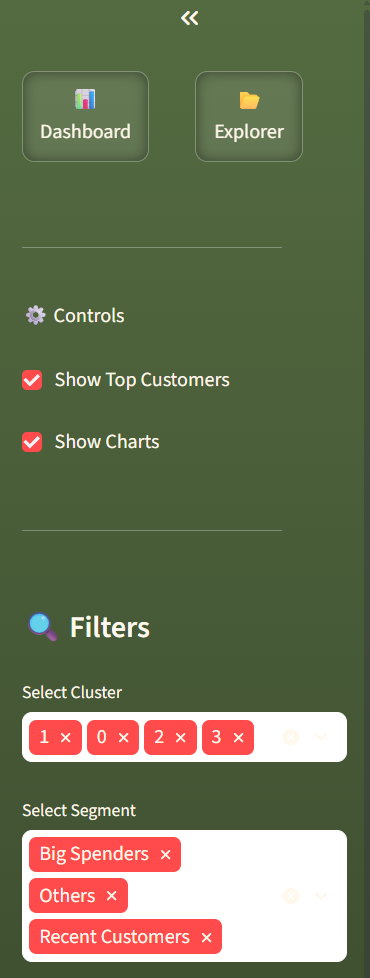

# 📊 Customer Segmentation & Revenue Optimization System
This project analyzes e-commerce transaction data to identify high-value customers and improve revenue using data-driven techniques.

---

## 🧠 Key Features
- RFM Analysis (Recency, Frequency, Monetary)
- K-Means Clustering for customer segmentation
- Interactive Streamlit dashboard
- Business insights & recommendations

---

## 🛠️ Tech Stack
- Python (Pandas, NumPy, Seaborn)
- SQL (SQLite)
- Scikit-learn
- Streamlit

---

## 📊 Dashboard Preview

### 🔹 Main Dashboard


---

### 🔹 Filters & Navigation


---

### 🔹 Charts & Insights


---

### 🔹 Data Explorer
 

---

## 📂 Dataset
Dataset is not included due to size limitations.

Download here:
👉https://drive.google.com/drive/folders/1sf-hfbRqsJCkavKGa6F6JTLKgDrrZ9Zg?usp=drive_link

## ⚙️ How to Run

1. Download dataset  
2. Place inside `data/` folder  
3. Run:
```bash
python -m streamlit run app/bi_like.py
